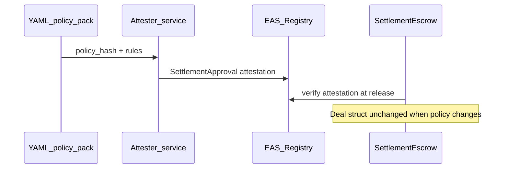

# Policy evolution

How AttestRWA handles regulatory and bank policy changes **without migrating
active escrow state**.

## Core principle

> **We do not migrate active escrow state. We migrate eligibility proofs.**

[`SettlementEscrow.sol`](../contracts/src/SettlementEscrow.sol) stores deposit
facts only (buyer, payee, token, amount, deadline). Compliance rules live in
the **attester** layer (YAML DSL). When policy changes, pending deals are not
silently rewritten — the system asks whether a valid `SettlementApproval`
attestation exists for release under the required policy context.

## Three paths

| Path | Meaning |
|------|---------|
| Existing attestation valid | On-chain checks still pass (schema, payee, capital class, expiry, trusted attester) |
| Fresh attestation | Attester re-evaluates under updated `ATTESTRWA_POLICY_FILE`; new UID if submitted on-chain |
| No valid approval | Escrow follows reject / refund paths |



## Policy provenance (v1)

Each attestation decision includes:

| Field | Source |
|-------|--------|
| `policy_pack_id` | `# pack_id:` in YAML comments, else filename stem |
| `policy_hash` | SHA-256 of policy file bytes |
| `evidence_hash` | Keccak of canonical evidence string **including** `policy_hash` |

API: `POST /attest/settlement` returns `policy_pack_id` and `policy_hash`.

## Reproduce locally

### Policy evolution simulation

```bash
./scripts/simulate-policy-evolution.sh
```

Runs pytest for:

- Relaxed ASEAN pack → **approve** (borderline SG amount, KYC tier 3)
- Strict ASEAN pack → **reject** (same deal context, different proof)

Policy files:

- [`data/policies/asean-property-settlement-v1.yaml`](../data/policies/asean-property-settlement-v1.yaml)
- [`data/policies/asean-property-settlement-v1-strict.yaml`](../data/policies/asean-property-settlement-v1-strict.yaml)

### RWA scenario matrix

```bash
uv run --directory apps/api python ../../scripts/run_rwa_scenarios.py --check
```

Report: [`RWA_SCENARIO_REPORT.md`](RWA_SCENARIO_REPORT.md)  
Dataset: [`data/synthetic/rwa/scenarios.json`](../data/synthetic/rwa/scenarios.json)

## Schema evolution (slow lane)

If the **EAS schema** changes, deploy a new escrow with a new immutable
`schemaUid`. Policy agility stays off-chain; enforcement stability stays
on-chain. See [`ATTESTATION_SCHEMA.md`](ATTESTATION_SCHEMA.md).

## Production path

Signed policy packs, HSM attester keys, live Chainalysis, and audit scope are
documented in [`PRODUCTION_ROADMAP.md`](PRODUCTION_ROADMAP.md) — not required
for the hackathon demo.
